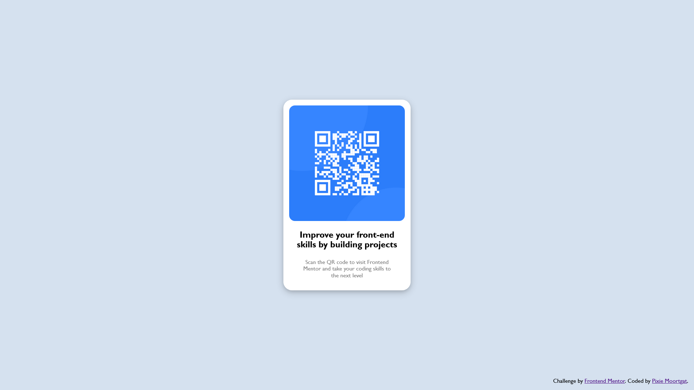

# Frontend Mentor - QR code component solution

This is a solution to the [QR code component challenge on Frontend Mentor](https://www.frontendmentor.io/challenges/qr-code-component-iux_sIO_H). Frontend Mentor challenges help you improve your coding skills by building realistic projects. 

## Table of contents

- [Screenshot](#screenshot)
- [Built with](#built-with)
- [Author](#author)

## Screenshot

## Built with

- [React](https://reactjs.org/)

## Author

- Frontend Mentor - [@PixieMgt](https://www.frontendmentor.io/profile/PixieMgt)